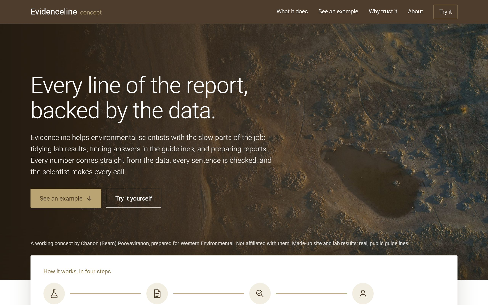
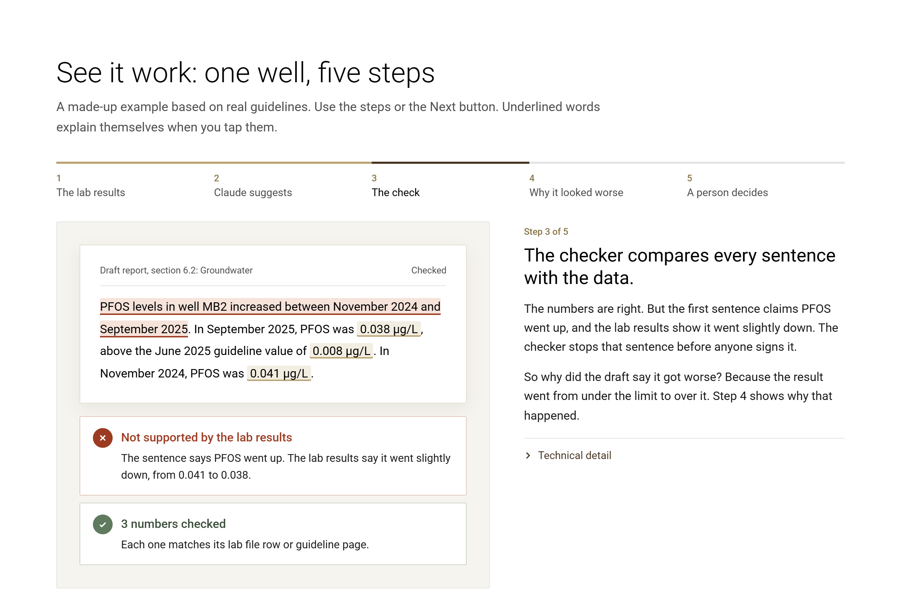
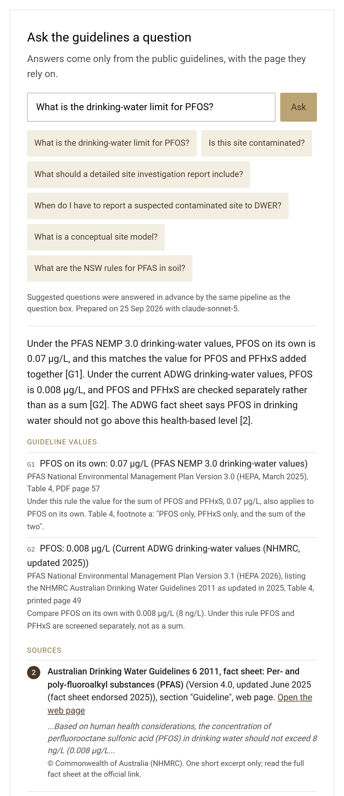
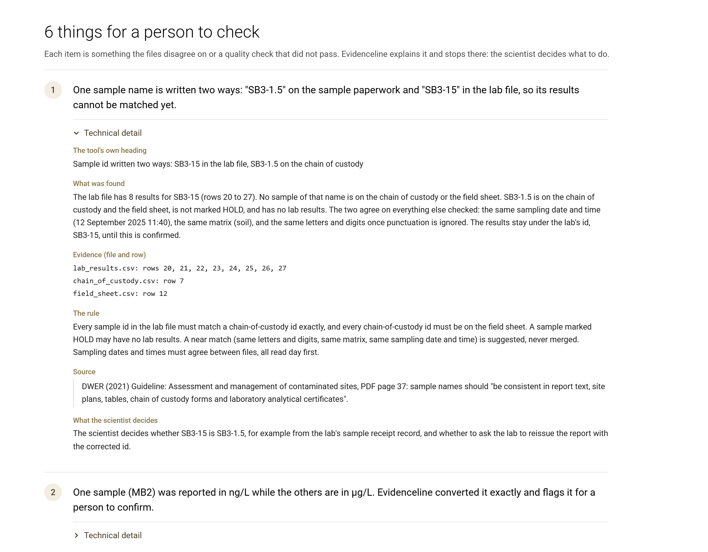

<!-- DRAFT for the owner's review. Nothing here is published until the owner approves it. -->

# Evidenceline

A working concept of an assistant for PFAS groundwater monitoring in Western Australia: it checks report text against lab data and guideline values, and shows where every number came from.
The site and every lab result are synthetic (a fictional site, FDS-01); the guidance is real and public; this is a personal project, not affiliated with any company.

**Live site:** https://evidenceline.autopilotyourworkflow.com (with a live question box and a hosted connector for
Claude; both are read-only and rate-limited)

## What it does and who it is for

It is for environmental scientists who screen lab results against guideline values and write reports that a person signs.
Evidenceline is a set of nine read-only tools that run inside Claude through MCP (the Model Context Protocol), in Python:

- **Tidy messy lab files.** It combines a lab results file, a chain of custody and a field sheet into one table, then lists
  numbered questions for the scientist (sample ids that do not match, unit mix-ups, duplicate differences, holding
  times, blanks, detection limits above a criterion), each with the rows it is based on and the rule it applied.
- **Screen results under both drinking-water rules, side by side.** WA names PFAS NEMP 3.0 as adopted; the national
  values were updated in 2025. Evidenceline shows both and never picks one.
- **Answer guidance questions** from the public documents, with the document, edition and page it relied on, or say
  "not covered" instead of guessing.
- **Write and check report text.** The model writes placeholders; code fills in the exact numbers; a checker then
  traces every number, change and comparison in the paragraph back to its lab row or guideline table.

A guideline value is an investigation level. Evidenceline never says water is unsafe or a site is contaminated; those
are a scientist's judgement.

## Screenshots

The home page. It works from the real public guidelines, with a sample site and lab results standing in for client data.



Step 3 of the walkthrough. Claude's draft says PFOS went up; the lab results show it went slightly down, so the
checker stops that sentence before anyone signs the report.



The question box. The answer gives both drinking-water values side by side, each with its document, table and page,
and the source it quotes.



Tidy lab files. Each thing the files disagree on comes with the rows it is based on, the rule, the source, and what
the scientist decides.



## Choices I made

- **Deterministic checks in code, not in the model.** Screening, sums, non-detects, unit conversion and the paragraph
  checker are plain Python with exact decimals. A model can suggest wording; it never decides whether a number is right.
- **Placeholders for numbers.** The model writes `{PFOS|MB2|Sep 2025}` and `fill_numbers` puts the value in from the
  data, with a numbered source for each. If one placeholder is wrong, nothing is filled.
- **Two rules side by side.** Every screening result is shown under PFAS NEMP 3.0 and under the current national
  values, with the arithmetic. Choosing between them stays with the scientist.
- **Redaction at the tool boundary.** Client, site and people's names listed in a local identifier file, and street
  addresses, lot numbers, emails and phone numbers found by built-in patterns, are replaced with placeholders before
  any tool output reaches a model, in any letter case or spacing. If a configured identifier file is missing or
  broken, every tool fails closed. Without that file, names are not redacted. The hosted connector loads a built-in
  file that lists only the fictional site's client and address.
- **Lexical search plus a number verifier on AI answers.** Guidance search is BM25 over page-sized chunks, so every
  passage has an exact page. The live question box only shows a written answer if code can find every number in it on
  the page it cites (or in the verified guideline values); otherwise it shows the passages alone.

## What went wrong

- **The first paragraph checker let 15 false claims pass.** An independent tester who had not written the code wrote
  adversarial cases from the lab data by hand; the first version failed 19 of them, 15 of which passed a false claim.
  All were fixed, and the cases stay in `tests/test_adversarial.py`.
- **Client names leaked through unusual spellings.** An independent tester got the fictional client name through
  the redaction with capitals, line breaks, tabs, no-break spaces and similar tricks. Matching now ignores case
  and separators; those cases are in `tests/test_adversarial_phase1.py`.
- **A number after the word "Lot" was mangled.** The redaction read "Lot" followed by a filled-in result as a land lot
  and turned "0.038" into "[LOT-1].038". Filled values are now put back between separately redacted stretches of text.
- **A guideline note misread its source.** The first data file said the PFAS NEMP 3.0 value of 0.07 ug/L applied only
  to the sum of PFOS and PFHxS. Table 4, footnote a says it means "PFOS only, PFHxS only, and the sum of the two".
  Both automated verification passes caught it; the note, the screening, the checker and the website now follow the
  footnote. The same passes could not find the word "Total" in the arsenic soil note's source, so it was removed. Two
  later independent re-checks read both sources again and confirmed both new notes. One of them also found that
  `lookup_limit`, asked for PFOS alone under NEMP 3.0, still named the sum as the quantity to compare; it now names
  PFOS on its own, and so does the question box.
- **Casual questions were refused.** The first held-out question set, written without seeing the search, found the
  right page first for only 6 of 24 questions: chatty words that no document contains outweighed the words that
  mattered. That set was then used to fix the search (17 of 24 after), so it became a tuning set. A second held-out
  set, never used for tuning, is the fair measure: the right page comes first for 12 of 24, and for 4 of its 12
  casual questions, so everyday wording is still the search's main weakness. A stricter check later found seven of
  its questions close in wording to tuning questions; left out, the score is 9 of 20 (casual 3 of 10), and the
  Accuracy page shows both.
- **The checker misread a guideline value as a result.** "below the current value of 0.03 ug/L" was read as a measured
  PFHxS result and flagged. The checker now recognises a rule name before the word "value"; the sentence is a test in
  `tests/test_checker.py`.

## What I'd do differently

- **Write the held-out questions first, and keep writing new ones.** The search was tuned on the same questions it
  was scored on, which flattered it. A held-out set written without seeing the search came later, and fixing the
  search on it used it up; a second one (`evals/guidance_heldout2.json`) is now the only fair score.
- **Add semantic search earlier.** Lexical search is exact about pages but misses questions worded unlike the
  documents, such as how PFAS samples should be stored.
- **Trace each number to the passage its own sentence cites.** The answer verifier ties every concentration to the
  guideline value cited in its own sentence, but a plain number is still accepted when it is found in any cited
  passage.
- **Read real lab export formats.** The tidy step works on one packaged fictional site, not on a folder of files.
- **Get a practitioner to review the guideline values.** Today they are checked by two independent automated passes
  against the source pages, and the site says exactly that.

## Quick start

Python 3.12 or later. The server needs only `mcp` and `pydantic`.

```sh
git clone https://github.com/autopilotyourworkflow/evidenceline
cd evidenceline
python -m venv .venv
.venv/bin/python -m pip install --upgrade pip     # Windows: .venv\Scripts\python
.venv/bin/python -m pip install -e .
```

Guidance search reads a local index built from the public documents, which are downloaded, never committed:

```sh
.venv/bin/python -m pip install -e . --group corpus   # needs pip 25.1 or later
.venv/bin/python scripts/fetch_corpus.py
.venv/bin/python scripts/build_index.py
```

Add the server to Claude Code (stdio), using the absolute path of your checkout:

```sh
claude mcp add evidenceline -- /path/to/evidenceline/.venv/bin/evidenceline-mcp
```

Or in a Claude Desktop or project `.mcp.json` config:

```json
{ "mcpServers": { "evidenceline": { "command": "/path/to/evidenceline/.venv/bin/evidenceline-mcp" } } }
```

Then ask Claude, for example: "Use the evidenceline tools to check this paragraph about well MB2: ...".

A read-only hosted copy is also available as a remote connector (no install, rate-limited, same nine tools). A run
of it inside Claude Code is saved in [docs/examples/claude-code-live-connector-2026-09-24.md](docs/examples/claude-code-live-connector-2026-09-24.md):

```sh
claude mcp add --transport http evidenceline-demo https://evidenceline.autopilotyourworkflow.com/mcp
```

The hosted copy loads a built-in identifier file for the fictional site only (`EVIDENCELINE_REDACT=builtin:fds01-demo`):
its made-up client name and address become placeholders, but any other client or people's names are not redacted.
Use it with the fictional site, not with client work.

Redaction reads an optional identifier file (`~/.evidenceline/redact.toml`; see `examples/redact.example.toml`).
Client, site and people's names are redacted only when listed there. Without it, the built-in patterns for emails,
WA lots, street addresses and Australian phone numbers still apply.

## Tools

| Tool | What it does |
|---|---|
| `tidy_lab_files` | Combines the lab file, chain of custody and field sheet for FDS-01 into 73 rows and six numbered review items, each with evidence rows, the rule, its quoted source and what the scientist decides. Rows on request (`include_rows`). |
| `get_review_item` | One review item with every evidence line quoted exactly from its file. |
| `get_results` | Well MB2's results over four rounds, each with its lab report, file and row. |
| `lookup_limit` | One drinking-water value with its document, table, page and WA status. |
| `compare_rules` | One monitoring round screened under both rules side by side, with the arithmetic. |
| `check_paragraph` | Every number, change, guideline and detection claim in a paragraph traced or flagged, and what was not checked. |
| `fill_numbers` | Replaces placeholders with exact values from code and returns a numbered source list. All or nothing. |
| `search_guidelines` | Passages from the public guidance with document, edition, WA status, page and link, or "not covered". |
| `show_redactions` | The placeholders in use and the patterns loaded, never the raw values. |

## Run the tests

```sh
.venv/bin/python -m pip install -e . --group dev --group api
.venv/bin/python -m pytest
.venv/bin/python -m ruff check src tests scripts
.venv/bin/python -m pyright                              # strict
.venv/bin/python -m evidenceline.guidance.evaluate            # search, tuning set 1 (golden)
.venv/bin/python -m evidenceline.guidance.evaluate --heldout   # tuning set 2 (the first held-out set)
.venv/bin/python -m evidenceline.guidance.evaluate --heldout2  # held-out set 2, never tuned on
.venv/bin/python scripts/prepublish_check.py             # nothing private in the repository
cd web && npm ci && npm run check && node tests/adversarial.mjs
```

Developer notes (layout, design decisions, known limits): [DEVNOTES.md](DEVNOTES.md). Going live: [DEPLOY.md](DEPLOY.md).

## Accuracy

Test results, search scores and the automated checks of every guideline value are on the site's
[Accuracy page](https://evidenceline.autopilotyourworkflow.com/accuracy). It leads with the held-out set the search was
never tuned on, and labels the two tuning sets as such. Each guideline value was checked by two independent automated
passes, and the notes reworded after them by two later re-checks. CI recomputes the page's data on every change and
keeps the result as a download. No practitioner has reviewed the values.

## Licence

Code: [Apache License 2.0](LICENSE). The guidance documents are not in this repository; each one keeps its own terms,
listed with its source in `src/evidenceline/data/corpus_manifest.json`, and the site quotes only short excerpts.

## Photo credits

Photos on the site are from Unsplash and Pexels contributors, used under the
[Unsplash License](https://unsplash.com/license) and the [Pexels License](https://www.pexels.com/license/):
Iain (@photoken123), oscabla, Sear Greyson, Nathan Hurst (Unsplash) and Alexey K. (Pexels). Details and photo pages:
[web/public/img/credits.md](web/public/img/credits.md).
